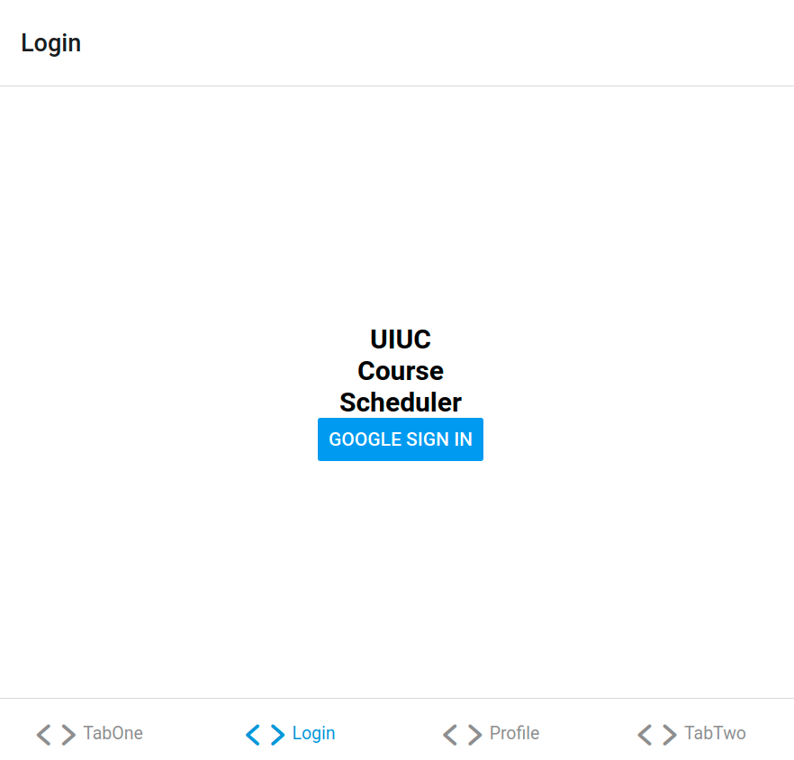
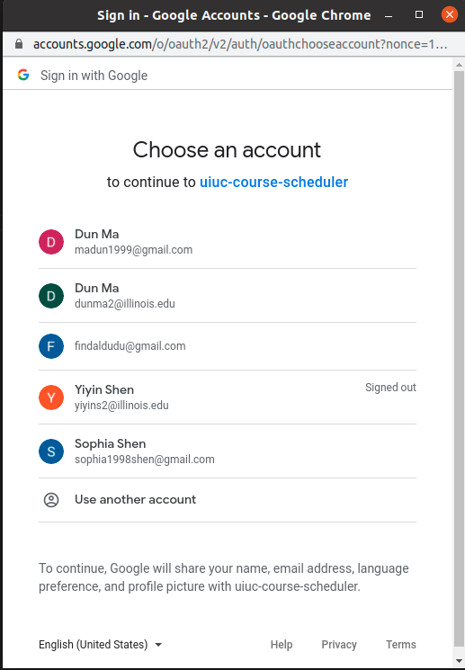
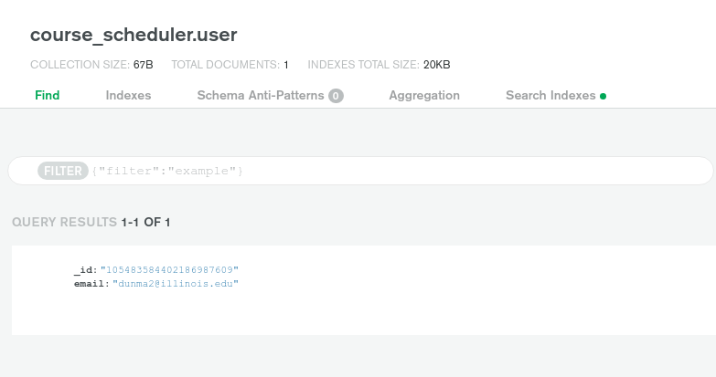
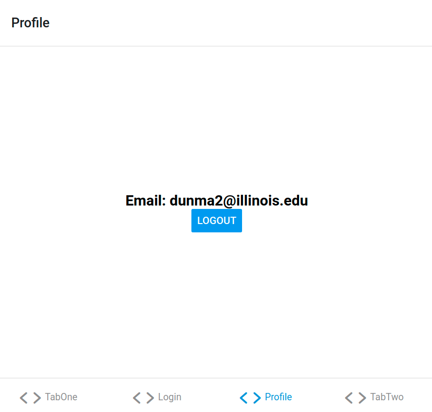
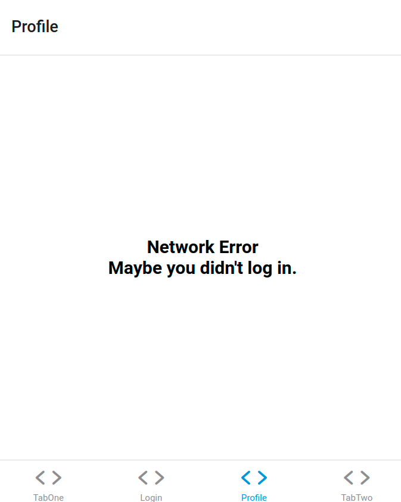

# Test plan

## Set up and Prerequisites
- running python server
  - set up python server according to `README.md`
- Working MongoDB
    - set up `.env` file according to `README.md`
- nodejs
  - set up expo app according to `README.md`

## Test Cases
### Login
    - Login screen with a button

### Google Login
    - Google login screen pop up
    - Navigate to User profile screen afterwards

    - User id and email stored in database

### User Profile
    - Shows user email
    - Logout button that sends back to login screen

    - Shows error if error
