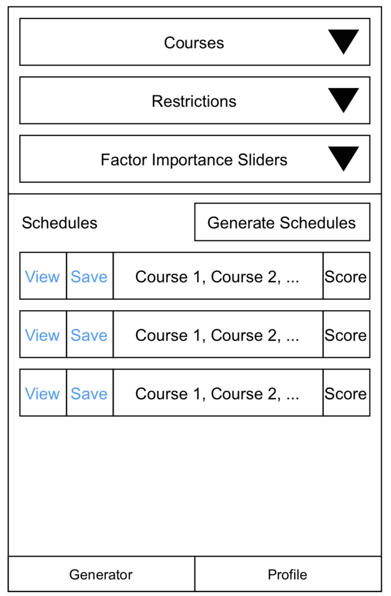
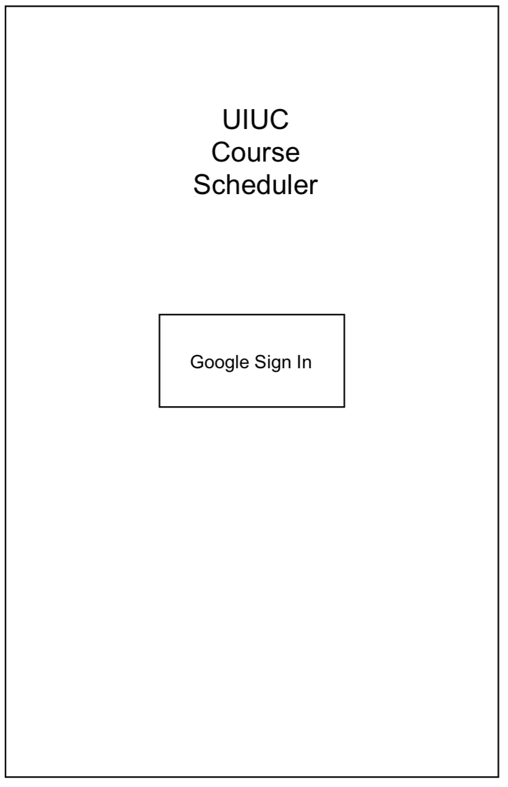
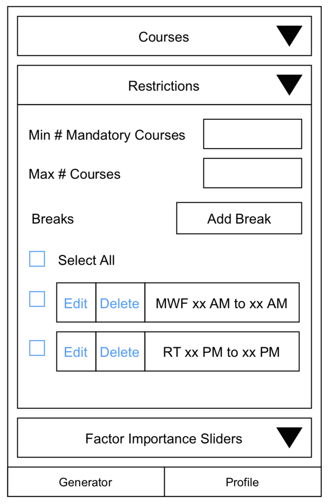
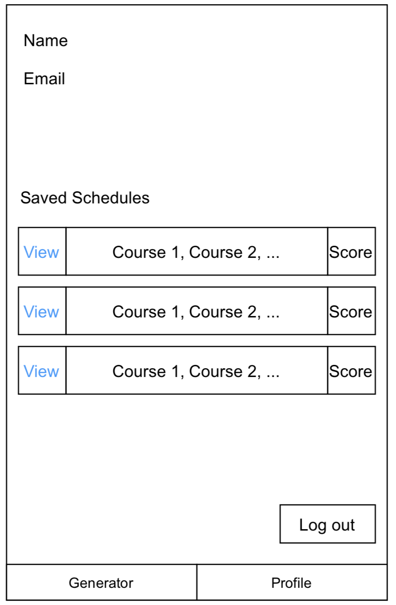
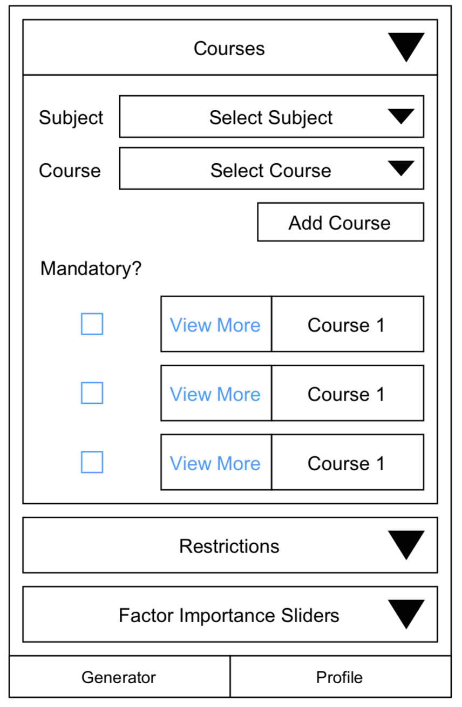
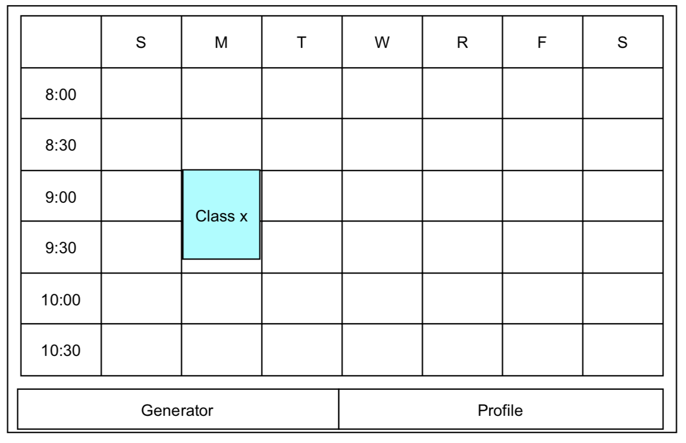
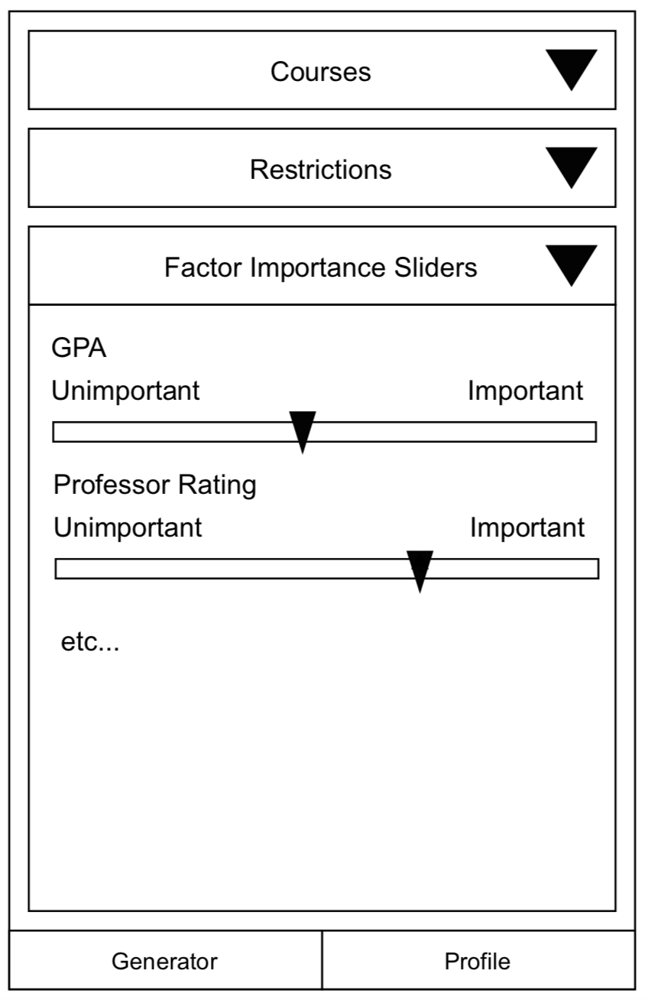
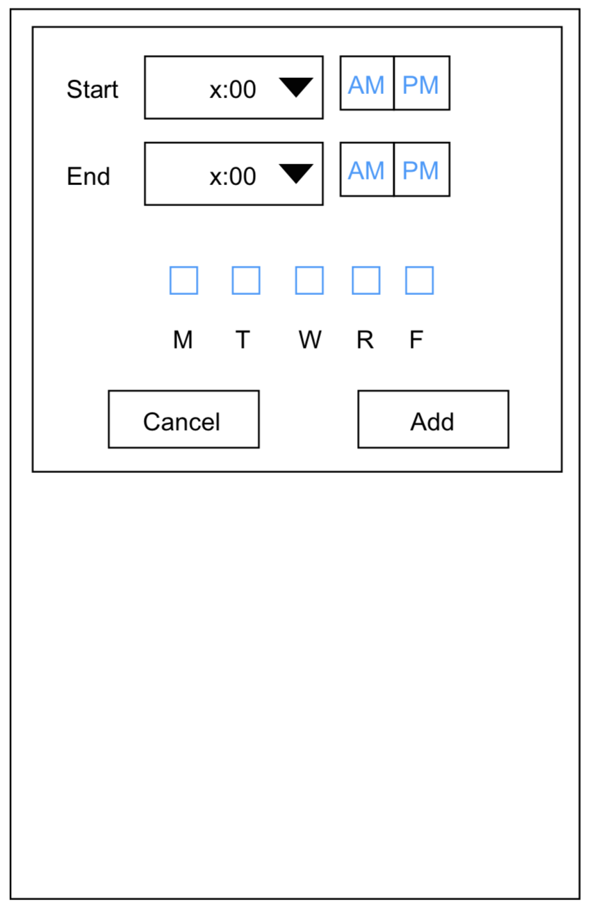
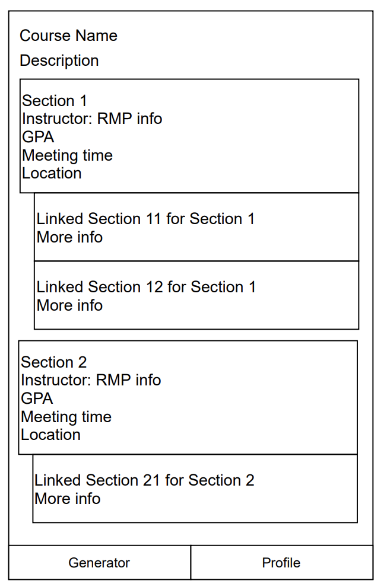

# UIUC Course Scheduler
Dun Ma (dunma2) Moderator: Brian Huang (brianbh2) 

Yiyin Shen (yiyins2) Moderator: Akhil Isanaka (isanaka2)

## Abstract 
---
### Project Purpose 
Create a mobile app that shows information about courses user added fetched from various platforms (Course Explorer, Rate My Professor, GPAs of Every Courses at UIUC) and generates possible schedules accordingly. 

### Project Motivation 
Students need to visit a lot of platforms to fetch information about one course and it takes a great deal of effort to manually generate a schedule to balance all the factors (GPAs, professor ratings). This app want to minimize this effort by writing a smart algorithm to generate possible schedules and give score of each schedule by user-given factors' weight. 

## Technical Specification
---
- Data Sources: 
  - CIS API (https://courses.illinois.edu/cisdocs/) (RESTful API)
  - Rate My Professor (Selenium)
  - GPAs of Every Courses at UIUC (Static)
- Programming Language: mobile app: React Native with JavaScript; backend: python 
- Stylistic Conventions: Python style guide, Airbnb React Native guideline,  JavaScript Style Guide 
- IDE: Visual Studio Code, PyCharm 
- Interface: React Native
- Backend: Flask, MongoDB, Selenium, GraphQL API

## Functional Specification
---
- User can Google sign-in to save courses and schedules. 
- For each course the following information will be demonstrated:
  - general information (meeting time, location, instructors, and etc.) from Course Explorer; 
  - ratings of professors, difficulties of courses, will-take-again rate, popular comments from Rate My Professor;
  - GPA for each professor from GPAs of Every Courses at UIUC.
- User can mark each course as mandatory or elective. 
- User can input the minimum number of mandatory courses to take. 
- User can input the maximum number of courses to take. 
- User can input break time. 
- All possible schedules will be demonstrated with the above restrictions.
- A set of sliders (from very unimportant to very important) allows user to input the importance of each factor. The factors are: 
  - GPA
  - Professor rating
  - Course difficulty
  - Will-take-again rate
- A score will be generated for each schedule based on the above factors
- Generated schedules will be shown.
- User can request previously generated schedules to be shown
## Brief Timeline
---
### Week 1: 
Dun Ma: 
- Set up Flask server with `flask_login`
- Set up Authentication using Google sign in 
  - `/login` route for token authentication.
  - `/logout` route for log out
- Fetch Google user information: 
  - Google Account ID
  - email
  - name
- Store the above user information into MongoDB on first login
- Set up React Native App: 
  - Sign in screen
    - Button for Google Sign-in. Goes to Profile screen if successful.
  - Profile screen
    - Display user information (email and name)
    - Button for Log out. 
  

Yiyin Shen: 

- Connect with CIS API 
- Given the year and semester: 
  - Fetch a list of all subjects in UIUC
  - Fetch a list of all courses for each subject
  - Able to fetch all information about the course and their IDs, including: 
    - Course Explorer URL 
    - Year
    - Semester 
    - Subject 
    - Course name 
    - Description 
    - Credit hours 
    - For each section: 
      - Section number 
      - Status code
      - Section status code 
      - Part of term 
      - Enrollment status 
      - Start date 
      - End date 
      - Start time 
      - End time 
      - Days of the Week 
      - Room number 
      - Building name
      - Instructors
  - Store above information into MongoDB
  
### Week 2: 
Dun Ma: 
- Create an algorithm to generate schedules based on courses. 
- `/graphql` route for GraphQL API. Requires authentication.
  - "subjects" query endpoint to get a list of all subjects
  - "courses" query endpoint to get a list of all courses given subject
  - "course-info" query endpoint to get selected course information given course code (subject and course number)
  - "schedule" query endpoint to generate schedules given list of course codes.
  - "user" query endpoint to get user information
  - `/graphql-explorer` for GraphQL Explorer API.
  
Yiyin Shen: 
- Clean up GPA data from GPAs of Every Courses at UIUC.
- Store GPA data into MongoDB
- Create the following static UI screen templates: 
  - Home:
    - add course + course list
    - generate schedule + schedule list
    - restrictions inputs
    - factor importance sliders'
    - button for generate schedule
  - View courses' information 
  - View schedule 
    - Display a schedule graphically
    - A button to save the schedule
  
### Week 3:
Dun Ma: 
- Update the algorithm to generate schedules based on restrictions
  - restrictions including:
    - minimum mandatory course
    - maximum course
    - breaks 
- Score schedules based on importance factors
- API
  - Update "schedule" query endpoint with restrictions and scores
  - Add "save" mutation endpoint to save selected schedules

Yiyin Shen:
- Update UI:
  - Make the screen from previous week dynamic 
  - Profile
    - Display a list of saved schedules in addition to profile.
  

  
### Week 4: 
Dun Ma: 
- Create a Selenium scrapper (We chose Selenium since Rate My Professor updates dynamically.) 
- Scrape the following information from Rate My Professor:
  - For each course: 
    - Professor's rating 
    - Course difficulty
    - Will-take-again rate 
    - Popular comments 
    - Number of ratings/comments 
- Store the above information into MongoDB 

Yiyin Shen:
- Update the algorithm to generate schedules based on more restrictions from rate my professor information
  - Establish connection between courses and professors.
- Score schedules based on importance factors from rate my professor information
- API
  - Update "schedule" query endpoint with new restrictions and scores

## Rubrics
---
### Week 1: 
Dun Ma: 
| Category | Total Score Allocated | Detailed Rubrics |
| --- | --- | --- |
| Set up Flask server | 1 | +1 for properly set up flask server |
| Set up React App | 1 | +1 for properly set up React App |
| Set up MongoDB | 1 | +1 for properly set up MongoDB |
| Backend authentication | 5 | +1 for implementing `/login` route   +1 for implementing `/logout` route   +2 for properly set up google authentication   +1 for properly storing user information to MongoDB|
| Frontend UI | 2 | +1 for Sign in Screen   +1 for Profile screen|
| Frontend authentication | 5 | +2 for handling google login workflow   +1 for navigation to profile screen and display correct information   +1 for login failed handling   +1 for implementing logout |
| Unit Test | 5 | +0.5 per unit test |
| Manual Test Plan | 5 | +0.5 per unit test  |

Yiyin Shen: 
| Category | Total Score Allocated | Detailed Rubrics |
| --- | --- | --- |
| Connect with CIS API | 1 | +1 successfully connect with CIS API |
| Create a Course Model | 3 | -2 for no data validation |
| Fetch a list of all subjects | 2 | +1 fetch and parse   +1 store in MongoDB |
| Fetch a list of all courses | 2 | +1 fetch and parse   +1 store in MongoDB |
| Fetch course information | 5 | +2 fetch   +2 parse into Course type/object   + 1 store in MongoDB |
| Error Handling | 2 | +1 for correctly handling CIS API error   +1 for correctly handling MongoDB error |
| Unit test | 5 | +0.5 per unit test |
| Manual Test Plan | 5 | +1 per manual test |
### Week 2: 
Dun Ma: 
| Category | Total Score Allocated | Detailed Rubrics |
| --- | --- | --- |
| Schedule object | 2 | +1 properly create the Schedule type/object   +1 properly connecting to MongoDB |
| Set up GraphQL API | 9 | +1 properly set up GraphQL API   +1 "subjects" query   +1 "courses" query   +1 "course-info" query   +1 "schedule" query   +1 "user" query   +1 correct authentication handling   +1 malformed query handling   +1 properly set up GraphQL Explorer|
| Schedule Algorithm | 6 | +3 schedules are correct   +1 handling linked sections   +2 use some advanced techniques to improve efficiency (e.g. dynamic programming) |
| GraphQL manual Test | 5 | +0.5 per manual test |
| Scheduler Unit Test | 5 | +0.5 per unit test | 

Yiyin Shen: 
| Category | Total Score Allocated | Detailed Rubrics |
| --- | --- | --- |
| GPA Data Cleaning | 5 | +3 convert GPA data into propitiate format   +2 store GPA to database   |
| Static Home Screen | 5 | +1 add course form & course list   +1 generate schedule button & schedule list   +1 restriction input forms   +1 add breaks form & breaks list    +1 importance factors' sliders |
| Static Course information Screen | 3 | +1 general course information   +1 section information   +1 GPA and Rate My Professor information |
| Static Schedule Screen | 3 | +1 calendar   +2 add courses | 
| Unit Test | 3 | +0.5 per unit test |
| Manual Test Plan | 5 | +1 per screen (max 5) |

### Week 3: 
Dun Ma: 
| Category | Total Score Allocated | Detailed Rubrics |
| --- | --- | --- |
| Schedule Algorithm | 5 | +1 implement mandatory course restriction   +1 implement max course restriction   +2 implement breaks restriction   +1 algorithm is correct |
| Score Algorithm | 2 | +1 implement importance factor's weight   +1 algorithm is correct |
| Update "schedule" API | 5 | +1 update "schedule" GraphQL endpoint with for each new restriction   +1 sort schedule by score   +1 authentication and error handling |
| New "save" API | 3 | +1 implementing "save" mutation in GraphQL   +1 saving to MongoDB   +1 authentication and error handling |
| Unit Test | 10 | +0.5 per unit test |

Yiyin Shen: 
| Category | Total Score Allocated | Detailed Rubrics |
| --- | --- | --- |
| Update Home Screen | 4 | +1 add course form & course list usable   +1 generate schedule button & schedule list connected to backend   +1 navigation to restriction screen    +1 navigation to importance screen |
| Update Course information Screen | 4 | +2 connected to backend   +1 handle loading   +1 handle error |
| Update Schedule Screen | 4 | +2 add courses   +1 handle loading   +1 handle error | 
| Update Profile Screen | 3 | +1 show all user information   +1 connect to backend   +1 handle error | 
| Manual Test Plan | 10 | +1 per screen (max 7)   +3 error handling view |

### Week 4: 
Dun Ma: 
| Category | Total Score Allocated | Detailed Rubrics |
| --- | --- | --- |
| scraping RateMyProfessor | 13 | +3 use Selenium correctly   +4 scraped Professor information correctly   +2 scrape on demand   +2 store scraped data in MongoDB   +2 handle scraping error   | 
| Unit Test| 5 | +0.5 per unit test |
| Manual Test Plan | 5 | +0.5 per manual test |

Yiyin Shen: 
| Category | Total Score Allocated | Detailed Rubrics |
| --- | --- | --- |
| Connect Professor and Course | 3 | +2 establish connections between professors and courses   +1 handle errors (e.g. missing professor) |
| Score Algorithm | 4 | +2 add professor factors to importance factor   +1 algorithm is correct    +1 handle missing data (i.e. no professor found in rateMyProfessor) |
| Update "schedule" API | 3 | +3 update "schedule" GraphQL endpoint with for each new scoring system |
| Unit Test | 5 | +0.5 per unit test |
| Manual Test Plan | 5 | +1 per manual test |

## Scoring Spreadsheets
Scoring Spreadsheets are available in the folder `scoring spreadsheets`.
## Figures
---
### Main Screen

### Login Screen

### Restriction Tab

### User Profile Screen

### Add Course Tab

### View Schedule Screen

### Factor Importance Tab

### Break Tab

### Course Info Screen

