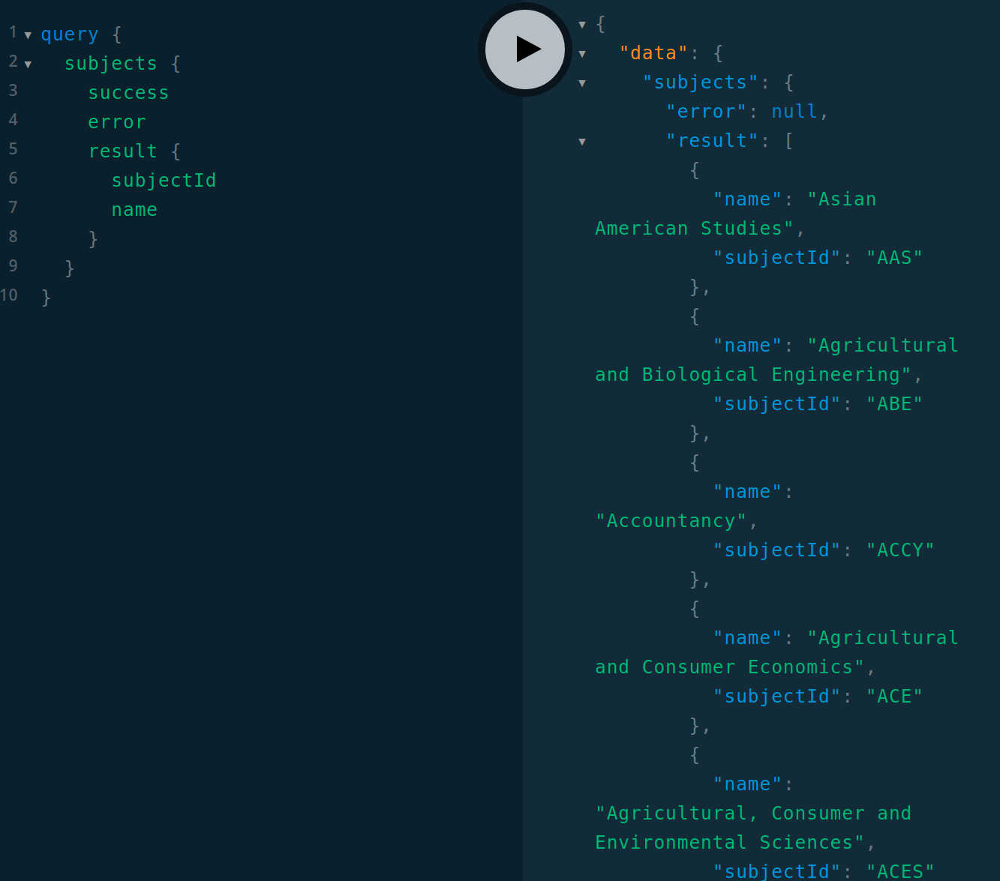
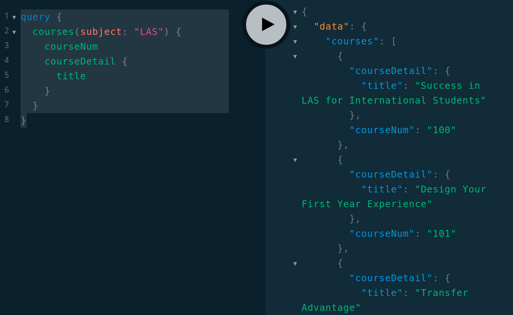
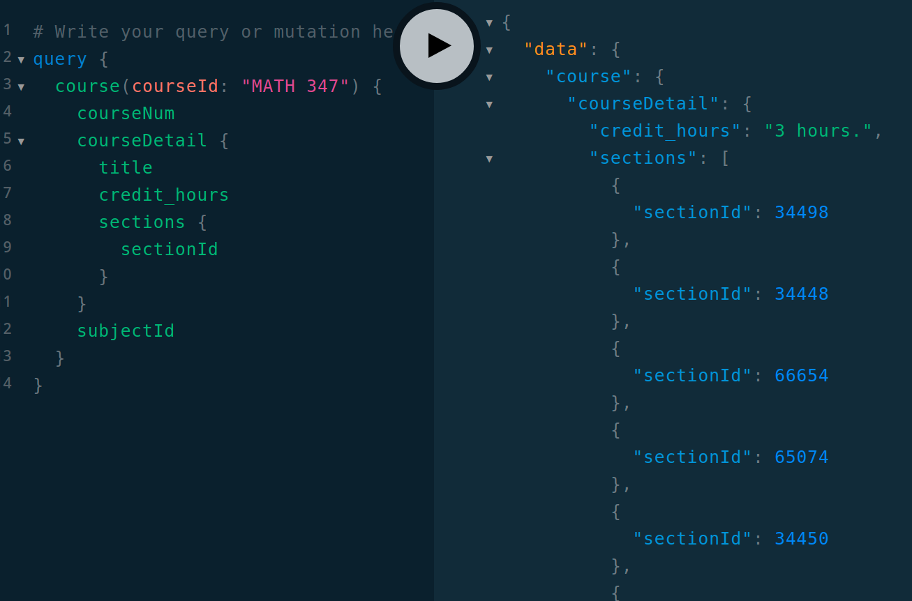
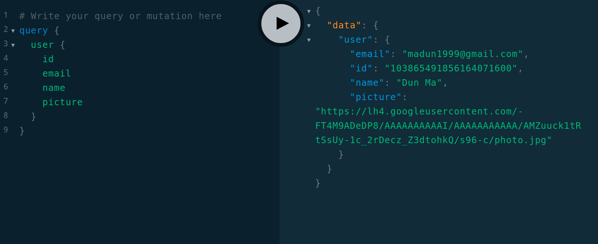
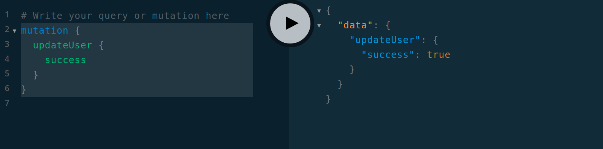
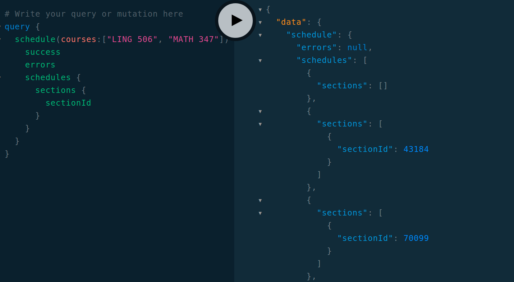

# GraphQL Test plan

## Set up and Prerequisites
- running python server
  - set up python server according to `README.md`
- Working MongoDB
    - set up `.env` file according to `README.md`
- Connect to '/graphql' route of the python server in a web browser to use GraphQL Explorer.

## Test Cases
### Subjects
```graphql
query {
  subjects {
    success
    error
    result {
      subjectId
      name
    }
  }
}
```


### Courses of subject
```graphql
query {
  courses(subject: "LAS") {
    courseNum
    courseDetail {
      title
    }
  }
}
```


### Course by course_id
```graphql
query {
  course(courseId: "MATH 347") {
    courseNum
    courseDetail {
      title
      credit_hours
      sections {
        sectionId
      }
    }
    subjectId
  }
}
```


### User information
```graphql
query {
  user {
    id
    email
    name
    picture
  }
}
```


### Update User
```graphql
mutation {
  updateUser {
    success
  }
}

```


### Schedule
```graphql
query {
  schedule(courses:["LING 506", "MATH 347"]) {
    success
    errors
    schedules {
      sections {
        sectionId
      }
    }
  }
}
```

