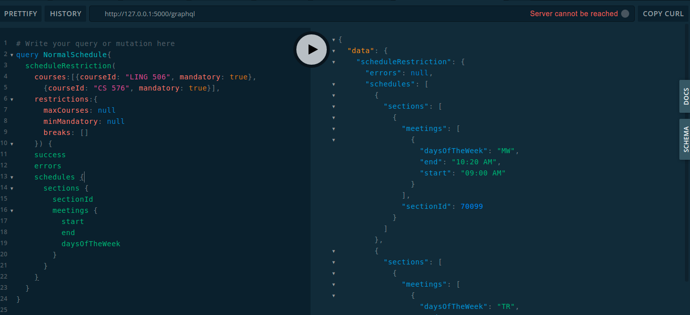
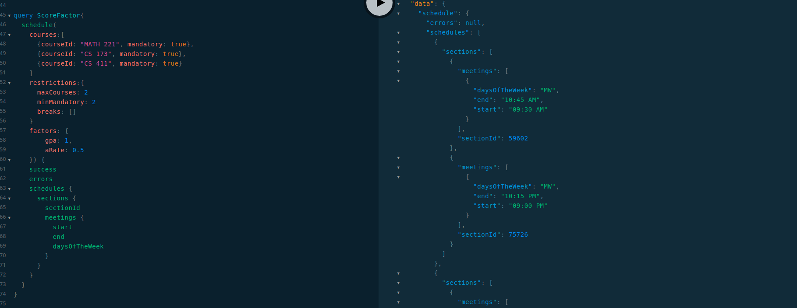
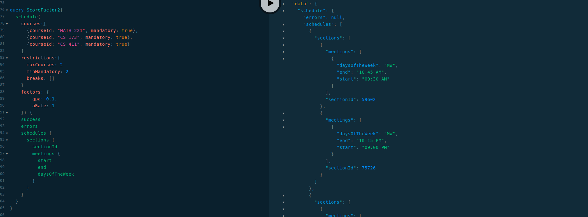
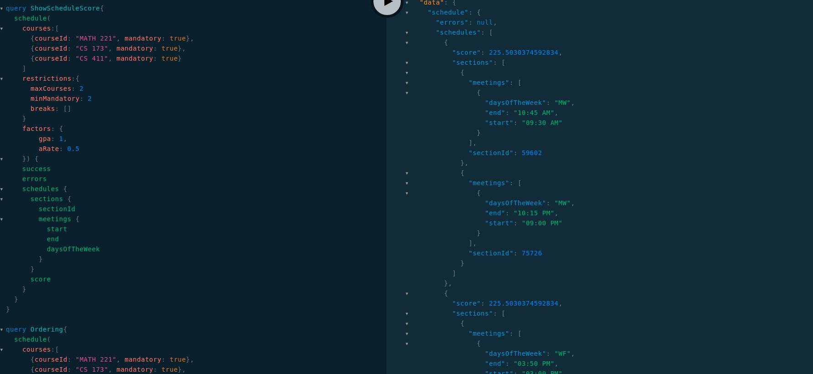
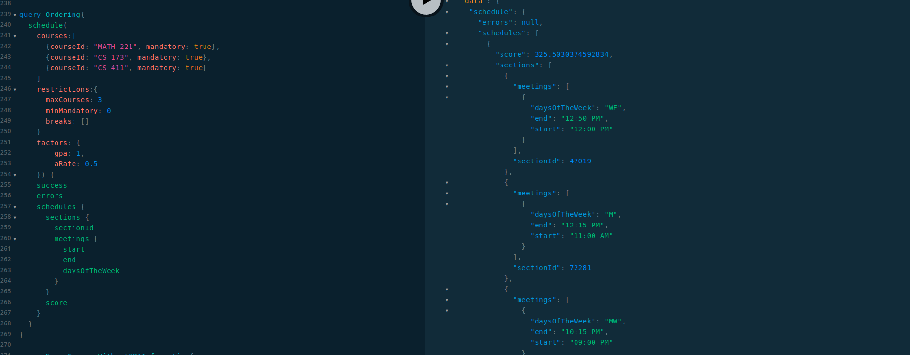
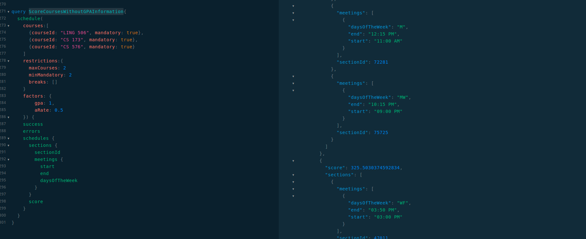

# GraphQL Test plan

## Set up and Prerequisites
- running python server
  - set up python server according to `README.md`
- Working MongoDB
    - set up `.env` file according to `README.md`
- Connect to '/graphql' route of the python server in a web browser to use GraphQL Explorer.

## Test Cases
### Subjects
```graphql
query {
  subjects {
    success
    error
    result {
      subjectId
      name
    }
  }
}
```


### Courses of subject
```graphql
query {
  courses(subject: "LAS") {
    courseNum
    courseDetail {
      title
    }
  }
}
```


### Course by course_id
```graphql
query {
  course(courseId: "MATH 347") {
    courseNum
    courseDetail {
      title
      credit_hours
      sections {
        sectionId
      }
    }
    subjectId
  }
}
```


### User information
```graphql
query {
  user {
    id
    email
    name
    picture
  }
}
```


### Update User
```graphql
mutation {
  updateUser {
    success
  }
}

```


### Schedule
```graphql
query {
  schedule(
    courses:[
      {courseId: "LING 506", mandatory: true}, 
      {courseId: "CS 576", mandatory: true}
    ]
    restrictions:{
      maxCourses: null
      minMandatory: null
      breaks: []
    }
    factors: {
        gpa: null,
        aRate: null
    }
  ){
    success
    errors
    schedules {
      sections {
        sectionId
      }
    }
  }
}
```


### Schedule with no Restriction
```graphql
query NormalSchedule{
  schedule(
    courses:[
      {courseId: "LING 506", mandatory: true}, 
      {courseId: "CS 576", mandatory: true}
    ]
    restrictions:{
      maxCourses: null
      minMandatory: null
      breaks: []
    }
    factors: {
        gpa: null,
        aRate: null
    }) {
    success
    errors
    schedules {
      sections {
        sectionId
        meetings {
          start
          end
          daysOfTheWeek
        }
      }
    }
  }
}
```



### Schedule with minimum mandatory course restriction
```graphql
query MinMandatoryRestriction{
  schedule(
    courses:[
      {courseId: "LING 506", mandatory: true}, 
      {courseId: "CS 576", mandatory: true}
    ]
    restrictions:{
      maxCourses: null
      minMandatory: 2
      breaks: []
    }
    factors: {
        gpa: null,
        aRate: null
    }
  ) {
    success
    errors
    schedules {
      sections {
        course {
          subjectId
          courseNum
        }
        sectionId
        meetings {
          start
          end
          daysOfTheWeek
        }
      }
    }
  }
}
```


### Schedule with maximum course restriction
```graphql
query MaxCourseRestriction{
  schedule(
    courses:[
      {courseId: "LING 506", mandatory: true}, 
      {courseId: "CS 576", mandatory: true}
    ]
    restrictions:{
      maxCourses: 1
      minMandatory: null
      breaks: []
    }
    factors: {
        gpa: null,
        aRate: null
    }
  ) {
    success
    errors
    schedules {
      sections {
        sectionId
        meetings {
          start
          end
          daysOfTheWeek
        }
      }
    }
  }
}
```


### Schedule with break restriction
```graphql
query BreakRestriction{
  schedule(
    courses:[
      {courseId: "LING 506", mandatory: true}, 
      {courseId: "CS 576", mandatory: true}
    ]
    restrictions:{
      maxCourses: null
      minMandatory: null
      breaks: [{
        start: "07:00 AM"
        end: "08:00 PM"
        daysOfTheWeek: "MTWRF"
      }]
    }
    factors: {
        gpa: null,
        aRate: null
    }) {
    success
    errors
    schedules {
      sections {
        sectionId
        meetings {
          start
          end
          daysOfTheWeek
        }
      }
    }
  }
}
```


### Schedule with average gpa and A rate factors
```graphql
query ScoreFactor{
  schedule(
    courses:[
      {courseId: "MATH 221", mandatory: true}, 
      {courseId: "CS 173", mandatory: true},
      {courseId: "CS 411", mandatory: true}
    ]
    restrictions:{
      maxCourses: 2
      minMandatory: 2
      breaks: []
    }
    factors: {
        gpa: 1,
        aRate: 0.5
    }) {
    success
    errors
    schedules {
      sections {
        sectionId
        meetings {
          start
          end
          daysOfTheWeek
        }
      }
    }
  }
}
```


```graphql
query ScoreFactor2{
  schedule(
    courses:[
      {courseId: "MATH 221", mandatory: true}, 
      {courseId: "CS 173", mandatory: true},
      {courseId: "CS 411", mandatory: true}
    ]
    restrictions:{
      maxCourses: 2
      minMandatory: 2
      breaks: []
    }
    factors: {
        gpa: 0.1,
        aRate: 1
    }) {
    success
    errors
    schedules {
      sections {
        sectionId
        meetings {
          start
          end
          daysOfTheWeek
        }
      }
    }
  }
}
```

### Schedule returning score
```graphql
query ShowScheduleScore{
  schedule(
    courses:[
      {courseId: "MATH 221", mandatory: true}, 
      {courseId: "CS 173", mandatory: true},
      {courseId: "CS 411", mandatory: true}
    ]
    restrictions:{
      maxCourses: 2
      minMandatory: 2
      breaks: []
    }
    factors: {
        gpa: 1,
        aRate: 0.5
    }) {
    success
    errors
    schedules {
      sections {
        sectionId
        meetings {
          start
          end
          daysOfTheWeek
        }
      }
      score
    }
  }
}
```


### Schedule orders higher score at the top
```graphql
query Ordering{
  schedule(
    courses:[
      {courseId: "MATH 221", mandatory: true}, 
      {courseId: "CS 173", mandatory: true},
      {courseId: "CS 411", mandatory: true}
    ]
    restrictions:{
      maxCourses: 3
      minMandatory: 0
      breaks: []
    }
    factors: {
        gpa: 1,
        aRate: 0.5
    }) {
    success
    errors
    schedules {
      sections {
        sectionId
        meetings {
          start
          end
          daysOfTheWeek
        }
      }
      score
    }
  }
}
```

### Schedule courses without GPA information
```graphql
query ScoreCoursesWithoutGPAInformation{
  schedule(
    courses:[
      {courseId: "LING 506", mandatory: true}, 
      {courseId: "CS 173", mandatory: true},
      {courseId: "CS 576", mandatory: true}
    ]
    restrictions:{
      maxCourses: 2
      minMandatory: 2
      breaks: []
    }
    factors: {
        gpa: 1,
        aRate: 0.5
    }) {
    success
    errors
    schedules {
      sections {
        sectionId
        meetings {
          start
          end
          daysOfTheWeek
        }
      }
      score
    }
  }
}
```


### Saving Schedule
```graphql
mutation StarSchedule {
  starSchedule (sectionIds: [70099, 71847]){
    success
    errors
  }
}
```


### Query Saved Schedule
```graphql
query GetUser {
  user {
    staredSchedules {
      sectionId
      course {
        courseNum
        subjectId
      }
    }
  }
}
```


### Schedule Scoring
```graphql
query GetUser {
  user {
    staredSchedules {
      sectionId
      course {
        courseNum
        subjectId
      }
    }
  }
}
```